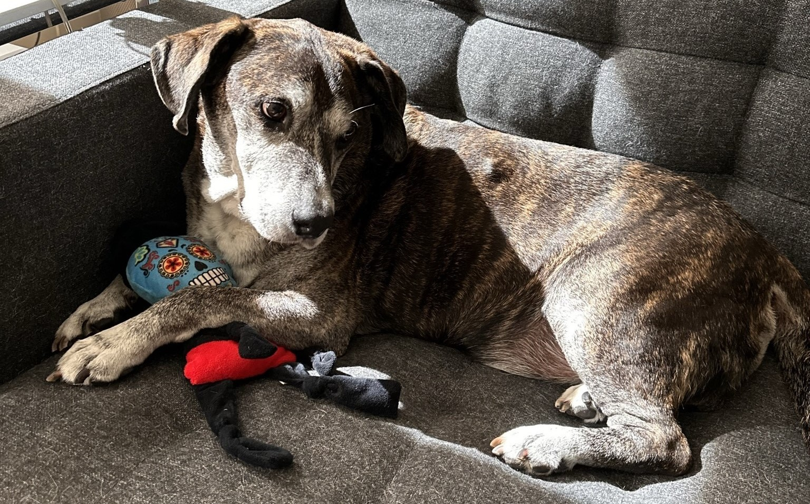
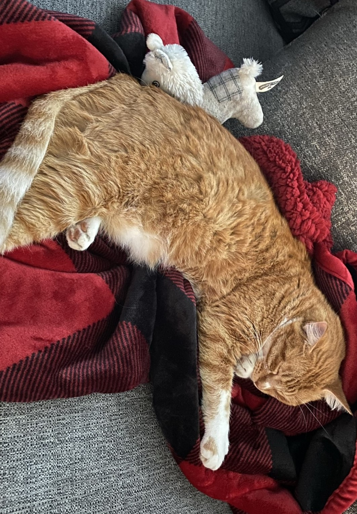
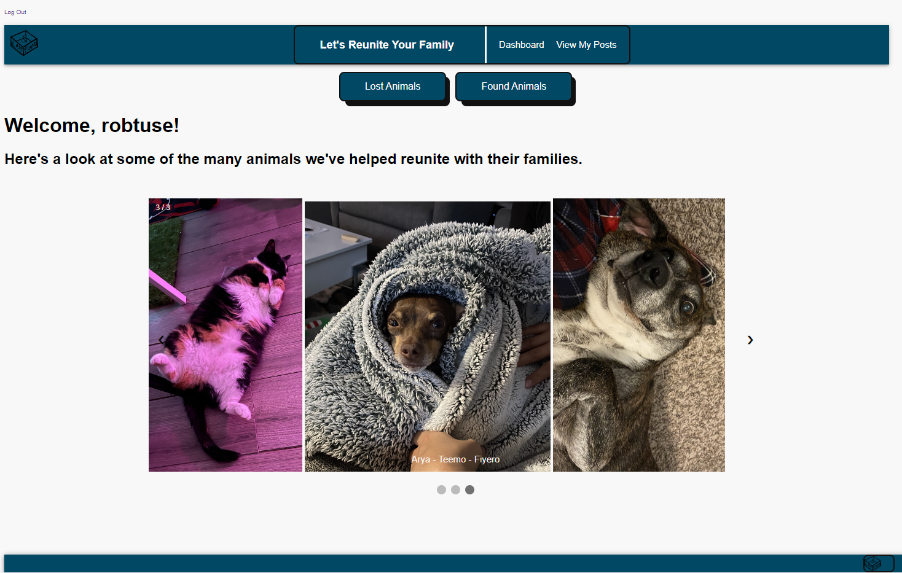

#   
 R&Ds Rescue 

    

* **Purpose of the app:** 
   This app was created to give the user an easy and interactive way to post about a pet that may have escaped out of the backyard or gotten away from them while walking. It is also a place to post if you FOUND a pet wandering the streets. This app will make it easier for pet owners to communicate with each other over a common goal: the safety of our pets!

    

* **Features on the app:**
    Our homepage first shows our pets that have already been located and returned to their owners! It is a celebration of us meeting our goals. In our "navigation bar", the user is given the option of viewing posts about pets that are lost or pets that have been found. From there they are able to make a post or comment on a post to better help other users locate their pets. There is also an option to view all of YOUR posts that you have made.

 

## Preview of R&Ds Rescue

## Live link: 
- [R&Ds Rescue](https://whispering-tor-24303.herokuapp.com/)

## Featured programs: 
- HTML, CSS, JavaScript, Node.js, ElephantSQL, Beekeeper Studio

## R&Ds Rescue builders:
- [Dmitry Shunin](https://https://github.com/Dimasik0204) 
- [Rob Hackett](https://github.com/Robhack623) 
- [Daniel Moros](https://github.com/Ddmoros) 
